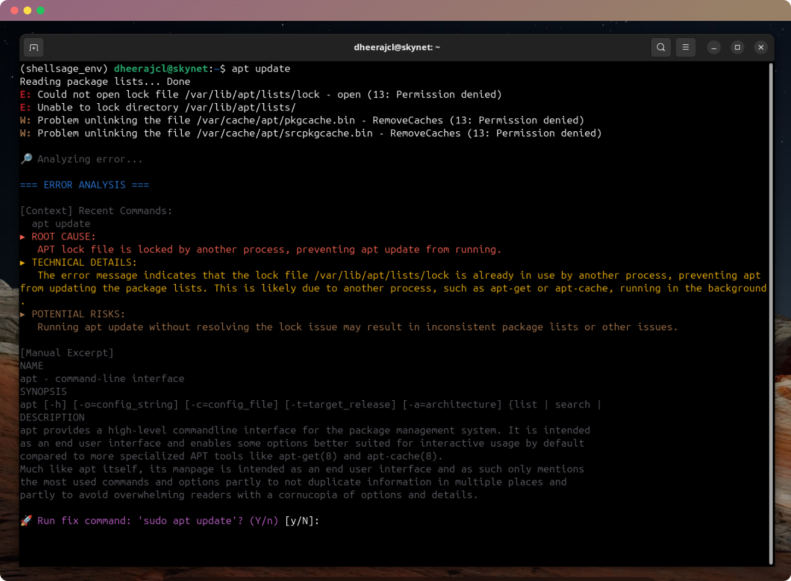
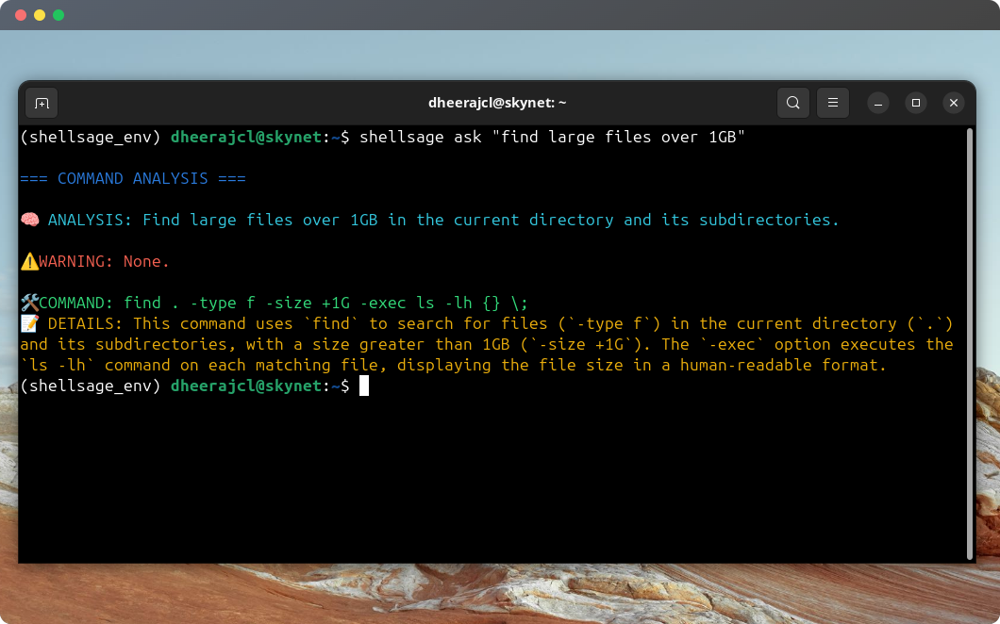
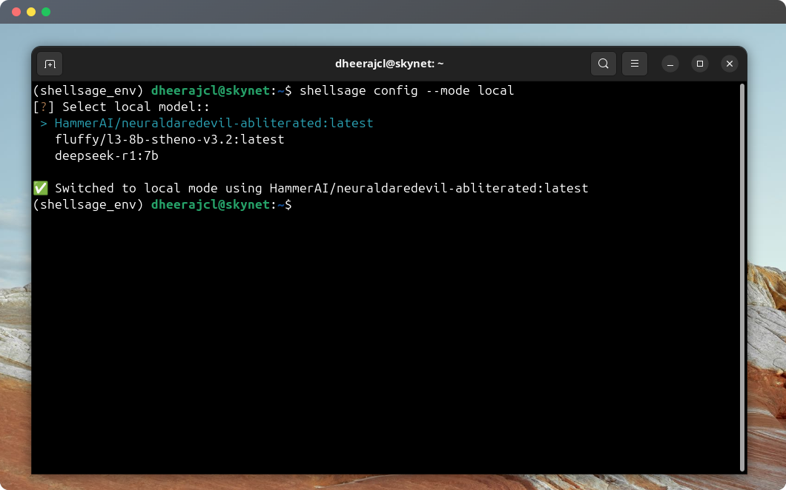
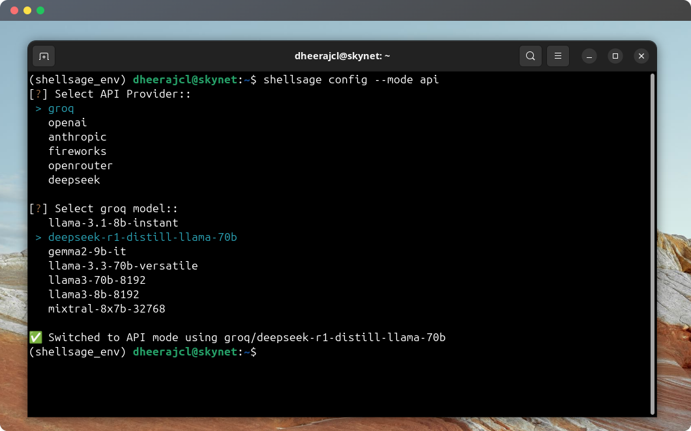

# Shell Sage 🐚✨

**Intelligent Terminal Companion | AI-Powered Terminal Assistant**  
*(Development Preview - v0.2.0)*

---

## Features

### 🌟 Next-Gen Terminal Experience
- 🏠 Local AI Support (Ollama) & Cloud AI (Groq)
- 🔍 Context-aware error diagnosis
- 🪄 Natural language to command translation
- ⚡ Safe command execution workflows

## 🔧 Core Capabilities

### Error Diagnosis

```bash
# Error analysis example
$ rm -rf /important-folder
🔎 Analysis → 🛠️ Fix: `rm -rf ./important-folder`
```


### Natural Language to Commands

```bash
# Command generation
$ shellsage ask "find large files over 1GB"
# → find / -type f -size +1G -exec ls -lh {} \;
```


### ⚡ Interactive Workflows
- Confirm before executing generated commands
- Step-by-step complex operations
- Safety checks for destructive commands


### 🌐 Supported API Providers
- Groq
- OpenAI
- Anthropic 
- Fireworks.ai
- OpenRouter
- Deepseek

*Switch providers with `shellsage config --provider <name>`*

---

## Installation

### Prerequisites
- Python 3.8+
- (4GB+ recommended for local models)

```bash
# 1. Clone & install Shell Sage
git clone https://github.com/dheerajcl/Terminal_assistant.git
cd Terminal_assistant
./install.sh

# 2. Install Ollama for local AI
curl -fsSL https://ollama.com/install.sh | sh

# 3. Get base model (3.8GB) 
#for example
ollama pull llama3:8b-instruct-q4_1

# or API key (Currently supports Groq, OpenAI, Anthropic, Fireworks, OpenRouter, Deepseek)
# put your desired provider api in .env file 
shellsage config --mode api --provider groq


```

### Configuration Notes
- Rename `.env.example` → `.env` and populate required values
- API performance varies by provider (Groq fastest, Anthropic most capable)
- Local models need 4GB+ RAM (llama3:8b) to 16GB+ (llama3:70b)
- Response quality depends on selected model capabilities


### Custom Model Selection

While we provide common defaults for each AI provider, many services offer hundreds of models. To use a specific model:

- Check your provider's documentation for available models
- Set in .env:
```
API_PROVIDER=openrouter
API_MODEL=your-model-name-here  # e.g. google/gemini-2.0-pro-exp-02-05:free

```

---


## Configuration

### First-Time Setup
```bash
# Interactive configuration wizard
shellsage setup

? Select operation mode: 
  ▸ Local (Privacy-first, needs 4GB+ RAM) 
    API (Faster but requires internet)

? Choose local model:
  ▸ llama3:8b-instruct-q4_1 (Recommended)
    mistral:7b-instruct-v0.3
    phi3:mini-128k-instruct

# If API mode selected:
? Choose API provider:
  ▸ Groq
    OpenAI
    Anthropic
    Fireworks
    Deepseek

? Enter Groq API key: [hidden input]

? Select Groq model:
  ▸ mixtral-8x7b-32768       
    llama3-70b-8192         # It isn't necessary to select models from the shown list, you can add any model of your choice supported by your provider in your .env `API_MODEL=`

✅ API configuration updated!

```

### Runtime Control

```bash
# Switch modes
shellsage config --mode api  # or 'local'


# Switch to specific model
shellsage config --mode local --model <model_name>

# Interactive switch
shellsage config --mode local
? Select local model: 
  ▸ llama3:8b-instruct-q4_1 
    mistral:7b-instruct-v0.3
    phi3:mini-128k-instruct
```





---

## Development Status 🚧

Shell Sage is currently in **alpha development**.  

**Known Limitations**:
- Limited Windows support
- Compatibility issues with zsh, fish
- Occasional false positives in error detection
- API mode requires provider-specific key

**Roadmap**:
- [x] Local LLM support
- [x] Hybrid cloud(api)/local mode switching
- [x] Model configuration wizard
- [ ] Better Context Aware
- [ ] Windows PowerShell integration
- [ ] Tmux Integration
- [ ] CI/CD error pattern database

---

## Contributing

We welcome contributions! Please follow these steps:

1. Fork the repository
2. Create feature branch (`git checkout -b feat/amazing-feature`)
3. Commit changes (`git commit -m 'Add amazing feature'`)
4. Push to branch (`git push origin feat/amazing-feature`)
5. Open Pull Request

---


> **Note**: This project is not affiliated with any API or model providers.  
> Local models require adequate system resources.
> Internet required for initial setup and API mode.  
> Use at your own risk with critical operations.
> Always verify commands before execution
